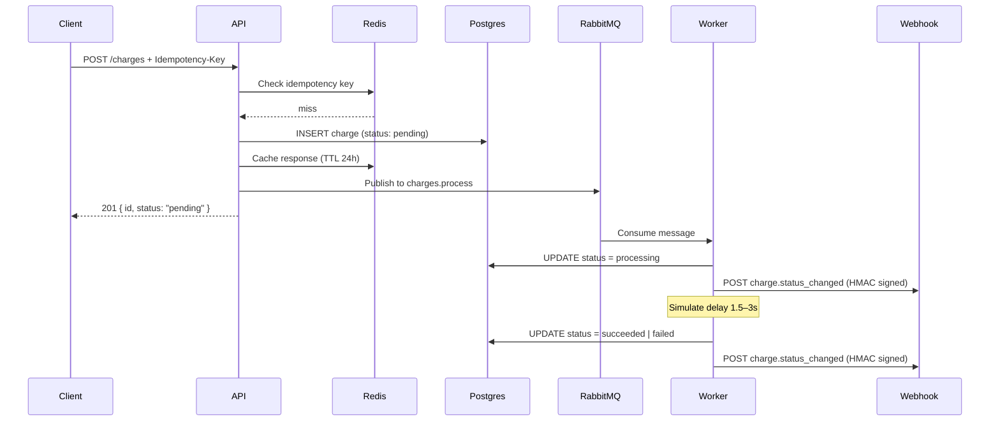

# payments-gateway-api

A mock payment gateway API that demonstrates production-grade back-end architecture patterns: async queue processing, idempotency, HMAC-signed webhooks, and observability.

[](https://github.com/diego-caldeira-12/payments-gateway-api/actions/workflows/ci.yml)

## Architecture



## Stack

| Layer | Technology |
|---|---|
| Runtime | Node.js 22 |
| Framework | Fastify 5 + TypeScript |
| Database | PostgreSQL 16 (Drizzle ORM) |
| Cache / Idempotency | Redis 7 (ioredis) |
| Queue | RabbitMQ 3.13 (amqplib) |
| Metrics | Prometheus (prom-client) |
| Infra | Docker Compose |

## Getting started

```bash
# 1. Clone and install
git clone https://github.com/diego-caldeira-12/payments-gateway-api.git
cd payments-gateway-api
npm install

# 2. Configure environment
cp .env.example .env

# 3. Start infrastructure
docker compose up postgres redis rabbitmq -d

# 4. Run migrations
npm run db:migrate

# 5. Start API and worker
npm run dev          # terminal 1
npm run worker       # terminal 2
```

Or run everything with Docker:

```bash
docker compose up --build
npm run db:migrate
```

## API Reference

### Charges

| Method | Path | Description |
|---|---|---|
| `POST` | `/charges` | Create a charge |
| `GET` | `/charges/:id` | Get a charge by ID |

**POST /charges**

```json
// Request
{
  "amount": 1990,        // required — value in cents
  "currency": "BRL",     // optional, default BRL
  "description": "Plan Pro"
}

// Headers (optional)
Idempotency-Key: <unique-string>

// Response 201
{
  "id": "uuid",
  "amount": 1990,
  "currency": "BRL",
  "description": "Plan Pro",
  "status": "pending",
  "createdAt": "...",
  "updatedAt": "..."
}
```

**Charge status machine:**
```
pending → processing → succeeded
                    ↘ failed
```

### Webhooks

| Method | Path | Description |
|---|---|---|
| `POST` | `/webhooks` | Register a callback URL |
| `GET` | `/webhooks` | List active endpoints |
| `DELETE` | `/webhooks/:id` | Deactivate an endpoint |

**POST /webhooks**

```json
// Request
{ "url": "https://your-server.com/callback" }

// Response 201 — save the secret, it won't be shown again
{ "id": "uuid", "url": "...", "secret": "<hex-64>", "active": true, "createdAt": "..." }
```

**Webhook payload (on every status change):**

```json
{
  "event": "charge.status_changed",
  "data": { ...charge },
  "timestamp": "2025-01-01T00:00:00.000Z"
}
```

**Verifying the signature:**

```ts
import { createHmac } from 'node:crypto';

const expected = 'sha256=' + createHmac('sha256', secret).update(rawBody).digest('hex');
const isValid = expected === request.headers['x-webhook-signature'];
```

Delivery is retried up to 4 times with exponential backoff (1s → 2s → 4s → 8s).

### Observability

| Path | Description |
|---|---|
| `GET /health` | Liveness check |
| `GET /metrics` | Prometheus metrics |

Key metrics exposed:
- `charges_created_total` — total charges created
- `charges_processed_total{status}` — worker outcomes by status
- `webhook_dispatch_total{outcome}` — webhook delivery success/failure
- `webhook_dispatch_duration_seconds` — delivery latency histogram
- Default Node.js process metrics (CPU, memory, event loop lag)

## Technical decisions

**Drizzle ORM over Prisma** — lighter runtime footprint, SQL-first approach, and native TypeScript types without a code generation step at runtime.

**Idempotency via Redis** — responses are cached by `Idempotency-Key` for 24 hours. The key is also persisted on the charge record so it survives cache eviction.

**RabbitMQ with `prefetch(1)`** — fair dispatch ensures the worker finishes one job before receiving the next, preventing message pile-ups under load.

**HMAC-SHA256 for webhooks** — clients verify authenticity by recomputing the signature with their shared secret. The secret is generated server-side and shown only once on registration.

**Exponential backoff on webhook retries** — avoids hammering a temporarily unavailable endpoint while still guaranteeing eventual delivery within the retry window.
